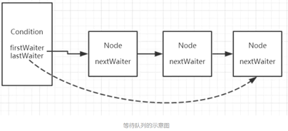

<!-- TOC -->

- [说明](#%e8%af%b4%e6%98%8e)
- [Condition与Object的比对](#condition%e4%b8%8eobject%e7%9a%84%e6%af%94%e5%af%b9)
- [等待方法](#%e7%ad%89%e5%be%85%e6%96%b9%e6%b3%95)
  - [await](#await)
  - [awaitUninterruptibly](#awaituninterruptibly)
  - [awaitNanos](#awaitnanos)
  - [awaitUntil](#awaituntil)
- [唤醒方法](#%e5%94%a4%e9%86%92%e6%96%b9%e6%b3%95)
  - [signal](#signal)
  - [signalAll](#signalall)
- [队列实现原理](#%e9%98%9f%e5%88%97%e5%ae%9e%e7%8e%b0%e5%8e%9f%e7%90%86)
- [await原理](#await%e5%8e%9f%e7%90%86)
- [signal/signalall原理](#signalsignalall%e5%8e%9f%e7%90%86)
- [参考](#%e5%8f%82%e8%80%83)

<!-- /TOC -->
# 说明

&emsp;&emsp;Condition在jdk1.5中开始出现，主要是用来替代传统Object对象中的wait和notify方法，Object的wait和notify/notify是与对象监视器配合完成线程间的等待/通知机制，而Condition与Lock配合完成等待通知机制，前者是java底层级别的，后者是语言级别的，具有更高的可控制性和扩展性相比来说更加安全和  高效。

# Condition与Object的比对

<style type="text/css">
.tg  {border-collapse:collapse;border-spacing:0;}
.tg td{font-family:Arial, sans-serif;font-size:14px;padding:10px 5px;border-style:solid;border-width:1px;overflow:hidden;word-break:normal;border-color:black;}
.tg th{font-family:Arial, sans-serif;font-size:14px;font-weight:normal;padding:10px 5px;border-style:solid;border-width:1px;overflow:hidden;word-break:normal;border-color:black;}
.tg .tg-amwm{font-weight:bold;text-align:center;vertical-align:top}
.tg .tg-0lax{text-align:left;vertical-align:top}
</style>
<table class="tg">
  <tr>
    <th class="tg-amwm">比对项</th>
    <th class="tg-amwm">Object Monitor Methods</th>
    <th class="tg-amwm">Condition</th>
  </tr>
  <tr>
    <td class="tg-0lax">前置条件</td>
    <td class="tg-0lax">获取对象锁</td>
    <td class="tg-0lax">使用Lock.lock()获取锁<br><span style="font-weight:400;font-style:normal">使用Lock.newCondition()获取Condition</span><br></td>
  </tr>
  <tr>
    <td class="tg-0lax">调用方式</td>
    <td class="tg-0lax">Object.wait()</td>
    <td class="tg-0lax">Condition.await()</td>
  </tr>
  <tr>
    <td class="tg-0lax">等待队列个数</td>
    <td class="tg-0lax">1</td>
    <td class="tg-0lax">多个</td>
  </tr>
  <tr>
    <td class="tg-0lax">当前线程释放锁并进入等待状态</td>
    <td class="tg-0lax">支持</td>
    <td class="tg-0lax">支持</td>
  </tr>
  <tr>
    <td class="tg-0lax">当前线程释放锁并进入等待状态，在等待状态中不响应中断</td>
    <td class="tg-0lax">不支持</td>
    <td class="tg-0lax">支持<br><span style="font-weight:400;font-style:normal">awaitUninterruptibly()</span><br></td>
  </tr>
  <tr>
    <td class="tg-0lax">当前线程释放锁并进入超时等待状态</td>
    <td class="tg-0lax">支持</td>
    <td class="tg-0lax">支持</td>
  </tr>
  <tr>
    <td class="tg-0lax">当前线程释放锁并进入等待状态到某个时刻</td>
    <td class="tg-0lax">不支持</td>
    <td class="tg-0lax">支持<br><span style="font-weight:400;font-style:normal">awaitUntil(Date deadline)</span><br></td>
  </tr>
  <tr>
    <td class="tg-0lax">唤醒等待队列中的一个线程</td>
    <td class="tg-0lax">支持notify</td>
    <td class="tg-0lax">支持signal</td>
  </tr>
  <tr>
    <td class="tg-0lax">唤醒等待队列中的所有线程</td>
    <td class="tg-0lax">支持notifyAll</td>
    <td class="tg-0lax">支持signalAll</td>
  </tr>
  <tr>
    <td class="tg-0lax">随机性</td>
    <td class="tg-0lax">唤醒随机</td>
    <td class="tg-0lax">可以唤醒指定条件的线程</td>
  </tr>
</table>

# 等待方法
## await

```java
/**
 * 当前线程进入等待状态，如果其他线程调用condition的signal
 * 或者signalAll方法并且当前线程获取Lock从await方法返回，
 * 如果在等待状态中被中断会抛出被中断异常；
 */
void await() throws InterruptedException;

/**
 * 同awaitNanos，支持自定义时间
 */
boolean await(long time, TimeUnit unit) throws InterruptedException;
```
## awaitUninterruptibly

```java
// 同await，但是不响应中断
void awaitUninterruptibly();
```
## awaitNanos

```java
/**
 * 当前线程进入等待状态直到被通知，中断或者超时；
 */
long awaitNanos(long nanosTimeout) throws InterruptedException;
```
## awaitUntil

```java
/**
 * 当前线程进入等待状态直到被通知，中断或者到了某个时间
 */
boolean awaitUntil(Date deadline) throws InterruptedException;
```
# 唤醒方法
## signal

```java
/**
 * 唤醒一个等待在condition上的线程，将该线程从等待队列中转移到同步队列中，
 * 如果在同步队列中能够竞争到Lock则可以从等待方法中返回。
 */
void signal();
```
## signalAll

```java
/**
 * 获取所有等待在condition上的线程
 */
void signalAll();
```
# 队列实现原理
Condition使用Lock的newCondition方法获取（Condition newCondition();）具体实现过程如下：

```java
public Condition newCondition() {
    return sync.newCondition();
}

final ConditionObject newCondition() {
    return new ConditionObject();
}
```
返回了AbstractQueuedSynchronizer中的内部类ConditionObject，Condition内部与lock（AQS思想）一样维护了一个等待队列。所有调用condition.await方法的线程会加入到等待队列中，并且线程状态转换为等待状态。

```java
/** First node of condition queue. */
private transient Node firstWaiter;
/** Last node of condition queue. */
private transient Node lastWaiter;
```
<div align=center>



</div>

1. 调用condition.await方法后线程依次尾插入到等待队列中，如图队列中的线程引用依次为Thread-0,Thread-1,Thread-2....Thread-8；
2. 等待队列是一个单向队列。
3.  多次调用lock.newCondition()方法创建多个condition对象，也就是一个lock可以持有多个等待队列。而在之前利用Object的方式实际上是指在对象Object对象监视器上只能拥有一个同步队列和一个等待队列，而并发包中的Lock拥有一个同步队列和多个等待队列。

<div align=center>


</div>

# await原理

```java
/**
 * Implements interruptible condition wait.
 * <ol>
 * <li> If current thread is interrupted, throw InterruptedException.
 * <li> Save lock state returned by {@link #getState}.
 * <li> Invoke {@link #release} with saved state as argument,
 *      throwing IllegalMonitorStateException if it fails.
 * <li> Block until signalled or interrupted.
 * <li> Reacquire by invoking specialized version of
 *      {@link #acquire} with saved state as argument.
 * <li> If interrupted while blocked in step 4, throw InterruptedException.
 * </ol>
 */
/**
 * 调用该方法之后，使当前获取lock的线程进入等待队列，
 * 如果该线程能够从await()方法返回的话一定是该线程获取了与condition相关联的lock。
 */
public final void await() throws InterruptedException {
    if (Thread.interrupted())//响应中断
        throw new InterruptedException();
    // 1. 将当前线程包装成Node，插入到等待队列中尾部；
    // 只有被signal/signalAll后会使得当前线程从等待队列中移至到同步队列中去
    Node node = addConditionWaiter();
    // 2. 释放当前线程所占用的lock，在释放的过程中会唤醒同步队列中的下一个节点
    int savedState = fullyRelease(node);
    int interruptMode = 0;
    while (!isOnSyncQueue(node)) {//退出条件：条件为false或者执行到break
    	// 3. 当前线程进入到等待状态,直到获得lock后才会从await方法返回，或者在等待时被中断会做中断处理
        LockSupport.park(this);
        if ((interruptMode = checkInterruptWhileWaiting(node)) != 0)
            break;
    }
    // 4. 自旋等待获取到同步状态（即获取到lock）
    // 退出await方法必须是已经获得了condition引用（关联）的lock
    if (acquireQueued(node, savedState) && interruptMode != THROW_IE)
        interruptMode = REINTERRUPT;
    if (node.nextWaiter != null) // clean up if cancelled
        unlinkCancelledWaiters();
    // 5. 处理被中断的情况
    if (interruptMode != 0)
        reportInterruptAfterWait(interruptMode);
}
```

```java
/**
 * Adds a new waiter to wait queue.
 * @return its new wait node
 */
private Node addConditionWaiter() {
    Node t = lastWaiter;
    // If lastWaiter is cancelled, clean out.
    if (t != null && t.waitStatus != Node.CONDITION) {
        unlinkCancelledWaiters();
        t = lastWaiter;
    }
    // 将当前线程分装成Node，并且加入到队尾（该队列没有头的链式队列与AQS中的带头链式队列不同）
    Node node = new Node(Thread.currentThread(), Node.CONDITION);
    if (t == null)
        firstWaiter = node;
    else
        t.nextWaiter = node;
    lastWaiter = node;
    return node;
}
```

```java
/**
 * Invokes release with current state value; returns saved state.
 * Cancels node and throws exception on failure.
 * @param node the condition node for this wait
 * @return previous sync state
 */
final int fullyRelease(Node node) {
    boolean failed = true;
    try {
        int savedState = getState();
        // 调用AQS的模板方法release方法释放AQS的同步状态并且唤醒在同步队列中头结点的后继节点引用的线程
        if (release(savedState)) {
        	// 成功释放，正常返回
            failed = false;
            return savedState;
        } else {
        	// 释放失败，抛出异常
            throw new IllegalMonitorStateException();
        }
    } finally {
        if (failed)
            node.waitStatus = Node.CANCELLED;
    }
}
```
<div align=center>


</div>
             

调用condition.await方法的线程必须是已经获得了lock，也就是当前线程是同步队列中的头结点。调用该方法后会使得当前线程所封装的Node尾插入到等待队列中

# signal/signalall原理
调用condition的signal或者signalAll方法可以将等待队列中等待时间最长的节点移动到同步队列中。

```java
/**
 * Moves the longest-waiting thread, if one exists, from the
 * wait queue for this condition to the wait queue for the
 * owning lock.
 *
 * @throws IllegalMonitorStateException if {@link #isHeldExclusively}
 *         returns {@code false}
 */
public final void signal() {
	// 先检测当前线程是否已经获取到了lock，否则抛出异常
    if (!isHeldExclusively())
        throw new IllegalMonitorStateException();
    // 获取等待队列中的头节点进行处理
    Node first = firstWaiter;
    if (first != null)
        doSignal(first);
}
```

```java
/**
 * Removes and transfers nodes until hit non-cancelled one or
 * null. Split out from signal in part to encourage compilers
 * to inline the case of no waiters.
 * @param first (non-null) the first node on condition queue
 */
private void doSignal(Node first) {
    do {
        if ( (firstWaiter = first.nextWaiter) == null)
            lastWaiter = null;
        // 将头节点从等待队列中移除
        first.nextWaiter = null;
        // while中transferForSignal方法对头结点做真正的处理
    } while (!transferForSignal(first) &&
             (first = firstWaiter) != null);
}
```
             

调用condition的signal的前提条件是当前线程已经获取了lock，该方法会使得等待队列中的头节点即等待时间最长的那个节点移入到同步队列，而移入到同步队列后才有机会使得等待线程被唤醒，即从await方法中的LockSupport.park(this)方法中返回，从而才有机会使得调用await方法的线程成功退出。
<div align=center>


</div>

# 参考
1. [详解Condition的await和signal等待/通知机制](https://www.jianshu.com/p/28387056eeb4)
2. 《Java并发编程的艺术》

