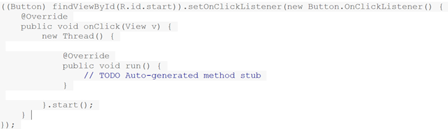

<!-- TOC -->

- [概述](#概述)
- [场景](#场景)
- [背景](#背景)
- [静态内部类/嵌套内部类](#静态内部类嵌套内部类)
- [成员内部类：定义在类内部的非静态类，就是成员内部类](#成员内部类定义在类内部的非静态类就是成员内部类)
- [局部内部类：内部类定义在方法和作用域内](#局部内部类内部类定义在方法和作用域内)
- [匿名内部类（要继承一个父类或者实现一个接口、直接使用 new 来生成一个对象的引用）](#匿名内部类要继承一个父类或者实现一个接口直接使用-new-来生成一个对象的引用)
    - [在使用匿名内部类时，要记住以下几个原则](#在使用匿名内部类时要记住以下几个原则)
    - [使用final修饰入参的原因](#使用final修饰入参的原因)
    - [有参构造函数](#有参构造函数)
- [内部类继承](#内部类继承)

<!-- /TOC -->

## 概述

1. 定义：外部类内部定义的类，类名不需要与文件名不同
2. static修饰（静态内部类）
3. 作用域（public、default、protected、private）
4. 作用范围：编译期概念，一但编译成功就是有不同的class文件（outer.class和outer$inner.class），所以内部类的成员变量/方法名可以和外部类的相同。
5. 分类：静态内部类，成员内部类，局部内部类，匿名内部类四种。

## 场景

Ø 在一个方法内部使用  
Ø 在方法的一个作用域中使用  
Ø 一个匿名类，用于实现一个接口  
Ø 一个匿名类，用于扩展拥有非默认构造器的类  
Ø 一个匿名类，用于执行字段初始化  
Ø 一个匿名类，通过实例初始化进行构建（匿名内部类不能拥有构造器)  

## 背景

1. 一个内部类的对象能够访问创建它的对象的实现，包括私有数据。即内部类实例对包含它的哪个类的实例来说，是特权的。
2. 对于同一个包中的其他类来说,内部类能够隐藏起来,换句话说，内部类不管方法的可见性如何，那怕是public，除了包容类，其他类都无法使用它。
3. 匿名内部类可以很方便的定义回调。
4. 使用内部类可以非常方便的编写事件驱动程序。

## 静态内部类/嵌套内部类

1. 被static修饰的内部类
2. 不需要维护与外部类的对象的关系（可以直接引用，比如：outer.inner），一般不会出现内存泄漏的问题
3. 嵌套类和普通的内部类还有一个区别：普通内部类不能有static数据和static属性，也不能包含嵌套类，但嵌套类可以。
4. 作用域修饰符：不能声明为private，一般声明为public，方便调用。
5. 静态内部类可以访问外部类所有的静态变量和方法，包括private
6. 静态内部类和一般类一致，可以定义静态变量、方法，构造方法等。
7. 其它类使用静态内部类需要使用“外部类.静态内部类”方式
8. Java集合类HashMap内部就有一个静态内部类Entry。Entry是HashMap存放元素的抽象， HashMap 内部维护 Entry 数组用了存放元素，但是 Entry 对使用者是透明的。像这种和外部类关系密切的，且不依赖外部类实例的，都可以使用静态内部类。

```java
package com.sunld.class1;
public class StaticInnerClass {
	private static int a = 11;
	private int b = 1;
	public static class Inner {
		public static void printInner() {
			System.err.println(a);
//			System.err.println(b); // 编译出错
		}
		public  void printInner1() {
			System.err.println(a);
		}
	}
	
	public static void main(String[] args) {
		StaticInnerClass.Inner.printInner();
		StaticInnerClass.Inner inner = new StaticInnerClass.Inner();
		inner.printInner1();
	}
}
```

## 成员内部类：定义在类内部的非静态类，就是成员内部类

1. 成员内部类，就是作为外部类的成员，可以直接使用外部类的所有成员和方法，即使是private的。
2. 同时外部类要访问内部类的所有成员变量/方法，则需要通过内部类的对象来获取。
要注意的是，成员内部类不能含有static的方法和变量（final 修饰的除外）。**因为成员内部类需要先创建了外部类，才能创建它自己的**，成员内部类是非静态的，类初始化的时候先初始化静态成员，如果允许成员内部类定义静态变量，那么成员内部类的静态变量初始化顺序是有歧义的。
3. 在成员内部类要引用外部类对象时，使用outer.this来表示外部类对象；
4. 而需要创建内部类对象，可以使用outer.inner  obj = outerobj.new inner();

```java
package com.sunld.class1;
public class Outer {
	public static void main(String[] args) {
		Outer outer = new Outer();
		Outer.Inner inner = outer.new Inner();
		inner.print("Outer.new");
		inner = outer.getInner();
		inner.print("Outer.get");
	}
	
	// 个人推荐使用getxxx()来获取成员内部类，尤其是该内部类的构造函数无参数时
	public Inner getInner() {
		return new Inner();
	}
	
	public class Inner {
		public void print(String str) {
			System.out.println(str);
		}
	}
}
```

## 局部内部类：内部类定义在方法和作用域内

定义在方法中的类，就是局部类。如果一个类只在某个方法中使用，则可以考虑使用局部类。

```java
package com.sunld.class1;

public class OutScope {
	private static int a;
	private int b;
	public void test(final int c) {
		final int d = 1;
		class Inner {
			public void print() {
				System.out.println(c);
			}
		}
	}
}
```

## 匿名内部类（要继承一个父类或者实现一个接口、直接使用 new 来生成一个对象的引用）

匿名内部类我们必须要继承一个父类或者实现一个接口，当然也仅能只继承一个父类或者实现一个接口。同时它也是没有class关键字，这是因为匿名内部类是直接使用new来生成一个对象的引用。
有时候我为了免去给内部类命名，便倾向于使用匿名内部类，因为它没有名字。例如：



匿名内部类是不能加访问修饰符的。**要注意的是，new匿名类，这个类是要先定义的**，看下面例子：

```java
package com.sunld.class1;
public class AnonymousOuter {
	public static void main(String[] args) {
		AnonymousOuter outer = new AnonymousOuter();
		Inner inner = outer.getInner("Inner", "gz");
		System.out.println(inner.getName());
	}
	public Inner getInner(final String name, String city) {
		return new Inner() {
			private String nameStr = name;
			public String getName() {
				return nameStr;
			}
		};
	}
}

//注释后，编译时提示类Inner找不到 
interface Inner {
	String getName();
}

```

### 在使用匿名内部类时，要记住以下几个原则

Ø 匿名内部类不能有构造方法。  
Ø 匿名内部类不能定义任何静态成员、方法和类。  
Ø 匿名内部类不能是public,protected,private,static  
Ø 只能创建匿名内部类的一个实例。  
Ø 一个匿名内部类一定是在new的后面，用其隐含实现一个接口或实现一个类。  
Ø 因匿名内部类为局部内部类，所以局部内部类的所有限制都对其生效。  
Ø 当所在的方法的形参需要被内部类里面使用时，该形参必须为final

### 使用final修饰入参的原因

“这是一个编译器设计的问题，如果你了解java的编译原理的话很容易理解。
首先，内部类被编译的时候会生成一个单独的内部类的.class文件，这个文件并不与外部类在同一class文件中。
当外部类传的参数被内部类调用时，从java程序的角度来看是直接的调用例如：

```java
public void dosome(final String a,final int b){ 
  class Dosome{public void dosome(){System.out.println(a+b)}};
  Dosome some=new Dosome(); 
  some.dosome(); 
}  
```

从代码来看好像是那个内部类直接调用的a参数和b参数，但是实际上不是，在java编译器编译以后实际的操作代码是

```java
class Outer$Dosome{
  public Dosome(final String a,final int b){
  this.Dosome$a=a;
  this.Dosome$b=b;
}
  public void dosome(){
    System.out.println(this.Dosome$a+this.Dosome$b);
 }
}
```

从以上代码看来，内部类并不是直接调用方法传进来的参数，而是内部类将传进来的参数通过自己的构造器备份到了自己的内部，自己内部的方法调用的实际是自己的属性而不是外部类方法的参数。 

这样理解就很容易得出为什么要用final了，因为两者从外表看起来是同一个东西，实际上却不是这样，如果内部类改掉了这些参数的值也不可能影响到原参数，然而这样却失去了参数的一致性，因为从编程人员的角度来看他们是同一个东西，如果编程人员在程序设计的时候在内部类中改掉参数的值，但是外部调用的时候又发现值其实没有被改掉，这就让人非常的难以理解和接受，为了避免这种尴尬的问题存在，所以编译器设计人员把内部类能够使用的参数设定为必须是final来规避这种莫名其妙错误的存在。”

> (简单理解就是，拷贝引用，为了避免引用值发生改变，例如被外部类的方法修改等，而导致内部类得到的值不一致，于是用final来让该引用不可改变)

### 有参构造函数

```java
package com.sunld.class1;
public class Outer1 { 
	public static void main(String[] args) { 
		Outer1 outer = new Outer1(); 
		Inner1 inner = outer.getInner("Inner", "gz"); 
		System.out.println(inner.getName()); 
	} 
	public Inner1 getInner(final String name, String city) { 
		return new Inner1(name, city) { 
			private String nameStr = name; 
			public String getName() { 
				return nameStr; 
			} 
		}; 
	} 
} 
abstract class Inner1 { 
	Inner1(String name, String city) { 
		System.out.println(city); 
	} 
	abstract String getName(); 
} 
```

注意这里的形参city，由于它没有被匿名内部类直接使用，而是被抽象类Inner的构造函数所使用，所以不必定义为final。
而匿名内部类通过实例初始化，可以达到类似构造器的效果：

```java
package com.sunld.class1;
public class Outer2 { 
	public static void main(String[] args) { 
		Outer2 outer = new Outer2(); 
		Inner2 inner = outer.getInner("Inner", "gz"); 
		System.out.println(inner.getName()); 
		System.out.println(inner.getProvince()); 
	} 
	public Inner2 getInner(final String name, final String city) { 
		return new Inner2() {
			private String nameStr = name; 
			private String province; 
			// 实例初始化 
			{ 
				if (city.equals("gz")) { 
					province = "gd"; 
				}else { 
					province = ""; 
				} 
			} 
			public String getName() { 
				return nameStr; 
			} 
			public String getProvince() { 
				return province; 
			} 
		}; 
	} 
} 
interface Inner2 { 
	String getName(); 
	String getProvince(); 
} 
```

## 内部类继承

内部类的继承，是指内部类被继承，普通类 extents 内部类。而这时候代码上要有点特别处理，具体看以下例子：

```java
package com.sunld.class1;
public class InheritInner extends WithInner.Inner { 
	// InheritInner() 是不能通过编译的，一定要加上形参 
	InheritInner(WithInner wi) { 
		wi.super(); 
	} 
	public static void main(String[] args) { 
		WithInner wi = new WithInner(); 
		InheritInner obj = new InheritInner(wi); 
	} 
} 
class WithInner { 
	class Inner { } 
} 
```

可以看到子类的构造函数里面要使用**父类的外部类对象.super()**;而这个对象需要从外面创建并传给形参.
