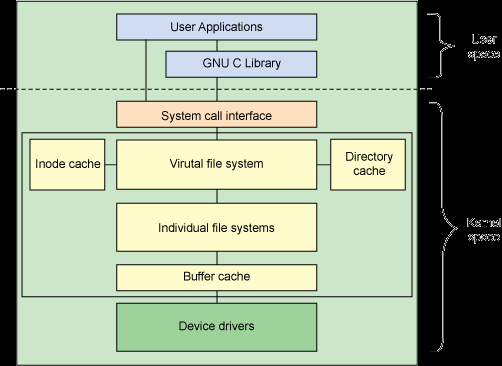

<!-- TOC -->

- [Linux文件系统详解](#linux文件系统详解)
  - [简介](#简介)
    - [挂载](#挂载)
      - [创建一个经过初始化的文件](#创建一个经过初始化的文件)
      - [文件设备化](#文件设备化)
      - [在该设备上创建文件系统(ext2)](#在该设备上创建文件系统ext2)
      - [挂载使用](#挂载使用)
  - [文件系统结构](#文件系统结构)
    - [VFS](#vfs)
    - [superblock](#superblock)
    - [inode](#inode)
      - [与block的关系](#与block的关系)
      - [查看inode信息](#查看inode信息)
      - [查看文件/目录类型](#查看文件目录类型)
      - [打开文件的步骤](#打开文件的步骤)
      - [inode大小](#inode大小)
    - [dentry](#dentry)
    - [缓冲区缓存](#缓冲区缓存)
  - [利用mmap函数实现内存映射的文件拷贝](#利用mmap函数实现内存映射的文件拷贝)
  - [参考](#参考)

<!-- /TOC -->
# Linux文件系统详解

## 简介

文件系统是对一个存储设备上的数据和元数据进行组织的机制。

### 挂载

1. 在 Linux 中将一个文件系统与一个存储设备关联起来的过程称为**挂载（mount）**；
2. 在执行挂载时，要提供文件系统类型、文件系统和一个挂载点

#### 创建一个经过初始化的文件

```bash
[root@instance-gctg007a ~]# dd if=/dev/zero of=file.img bs=1k count=10000
10000+0 records in
10000+0 records out
10240000 bytes (10 MB) copied, 0.0248517 s, 412 MB/s
```

#### 文件设备化

```bash
[root@instance-gctg007a ~]# losetup /dev/loop0 /root/file.img
[root@instance-gctg007a ~]# lsblk
NAME   MAJ:MIN RM  SIZE RO TYPE MOUNTPOINT
vda    253:0    0   40G  0 disk 
└─vda1 253:1    0   40G  0 part /
loop0    7:0    0  9.8M  0 loop 
[root@instance-gctg007a ~]# df -h
Filesystem      Size  Used Avail Use% Mounted on
devtmpfs        990M     0  990M   0% /dev
tmpfs          1000M     0 1000M   0% /dev/shm
tmpfs          1000M  105M  896M  11% /run
tmpfs          1000M     0 1000M   0% /sys/fs/cgroup
/dev/vda1        40G  4.1G   34G  11% /
tmpfs           200M     0  200M   0% /run/user/0
```

#### 在该设备上创建文件系统(ext2)

```bash
[root@instance-gctg007a ~]# mke2fs -c /dev/loop0 10000
mke2fs 1.42.9 (28-Dec-2013)
Discarding device blocks: done                            
Filesystem label=
OS type: Linux
Block size=1024 (log=0)
Fragment size=1024 (log=0)
Stride=0 blocks, Stripe width=0 blocks
2512 inodes, 10000 blocks
500 blocks (5.00%) reserved for the super user
First data block=1
Maximum filesystem blocks=10485760
2 block groups
8192 blocks per group, 8192 fragments per group
1256 inodes per group
Superblock backups stored on blocks: 
	8193
Checking for bad blocks (read-only test): done
Allocating group tables: done                            
Writing inode tables: done                            
Writing superblocks and filesystem accounting information: done
```

#### 挂载使用

```bash
[root@instance-gctg007a ~]# mkdir /mnt/mount01
[root@instance-gctg007a ~]# mount -t ext2 /dev/loop0 /mnt/mount01/
[root@instance-gctg007a ~]# ll /mnt/mount01/
total 12
drwx------ 2 root root 12288 Aug 25 10:45 lost+found
[root@instance-gctg007a ~]# df -h
Filesystem      Size  Used Avail Use% Mounted on
devtmpfs        990M     0  990M   0% /dev
tmpfs          1000M     0 1000M   0% /dev/shm
tmpfs          1000M  105M  896M  11% /run
tmpfs          1000M     0 1000M   0% /sys/fs/cgroup
/dev/vda1        40G  4.1G   34G  11% /
tmpfs           200M     0  200M   0% /run/user/0
/dev/loop0      9.5M   92K  8.9M   2% /mnt/mount01
[root@instance-gctg007a ~]# lsblk
NAME   MAJ:MIN RM  SIZE RO TYPE MOUNTPOINT
vda    253:0    0   40G  0 disk 
└─vda1 253:1    0   40G  0 part /
loop0    7:0    0  9.8M  0 loop /mnt/mount01
```

## 文件系统结构

<div align=center>


Linux 文件系统组件的体系结构

</div>

1. 应用程序：文件系统的使用者
2. GNU C 库（glibc）：为文件系统调用（open、read、、write、）提供用户接口
3. 系统调用接口：用户空间与内核空间的适配器完成信息的转发
4. VFS 是底层文件系统的主要接口。这个组件导出一组接口，然后将它们抽象到各个文件系统，各个文件系统的行为可能差异很大。有两个针对文件系统对象的**缓存（inode 和 dentry）**。它们缓存最近使用过的文件系统对象。
5. 每个文件系统实现（比如 ext2、JFS 等等）导出一组通用接口，供 VFS 使用。
6. 缓冲区缓存会缓存文件系统和相关块设备之间的请求。例如，对底层设备驱动程序的读写请求会通过缓冲区缓存来传递。这就允许在其中缓存请求，减少访问物理设备的次数，加快访问速度。以最近使用（LRU）列表的形式管理缓冲区缓存。注意，可以使用**sync**命令将缓冲区缓存中的请求发送到存储媒体（迫使所有未写的数据发送到设备驱动程序，进而发送到存储设备）。

### VFS

1. VFS 文件表示一个打开的文件（保存打开的文件的状态，比如写偏移量等等）
2. VFS 作为文件系统接口的根层。VFS 记录当前支持的文件系统以及当前挂装的文件系统
3. 在linux中可以使用一组注册函数动态地添加或删除文件系统
4. 在注册新的文件系统时，会把这个文件系统和它的相关信息添加到 file_systems 列表中（linux/include/linux/mount.h）

<div align=center>


向内核注册的文件系统

</div>

5. 查看支持的文件系统：cat /proc/filesystems
6. 查看已经加载的文件系统：cat /etc/filesystems
7. 查看系统包含的文件系统驱动：ls /lib/modules/$(uname -r)/kernel/fs/
8. VFS 中维护的另一个结构是挂装的文件系统。这个结构提供当前挂装的文件系统（见 linux/include/linux/fs.h）。它链接超级块结构。

<div align=center>


挂装的文件系统列表

</div>

### superblock

1. 超级块在每个文件系统的根上，超级块描述和维护文件系统的状态。
2. 超级块结构表示一个文件系统。它包含管理文件系统所需的信息，包括文件系统名称（比如 ext2）、文件系统的大小和状态、块设备的引用和元数据信息（比如空闲列表等等）。超级块通常存储在存储媒体上，但是如果超级块不存在，也可以实时创建它。可以在 ./linux/include/linux/fs.h 中找到超级块结构。

<div align=center>


超级块结构和 inode 操作

</div>

3. 超级块操作的定义。这个结构定义一组用来管理这个文件系统中的 inode 的函数。例如，可以用 alloc_inode 分配 inode，用destroy_inode 删除 inode。可以用 read_inode 和 write_inode 读写 inode，用 sync_fs 执行文件系统同步。可以在 ./linux/include/linux/fs.h 中找到 super_operations 结构。每个文件系统提供自己的 inode 方法，这些方法实现操作并向 VFS 层提供通用的抽象。

### inode

1. 文件系统中管理的每个对象（文件或目录）在 Linux 中表示为一个 inode。
2. inode 包含管理文件系统中的对象所需的所有元数据（包括可以在对象上执行的操作），**一个文件必须占用一个inode，至少占用一个block**
3. 文件系统中的一个对象，具有唯一标识符；各个文件系统提供将文件名映射为惟一 inode 标识符和 inode 引用的方法
4. 包括的信息：字节数、属主UserID、属组GroupID、读写执行权限、时间戳等，但是不包括文件名，文件名存储在目录中，在linux中使用inode号码识别文件
5. inode_operations 定义直接在 inode 上执行的操作，而 file_operations 定义与文件和目录相关的方法（标准系统调用）

<div align=center>


inode 结构和相关联的操作

</div>

4. inode 和目录缓存分别保存最近使用的 inode 和 dentry。注意，对于 inode 缓存中的每个 inode，在目录缓存中都有一个对应的 dentry。可以在 ./linux/include/linux/fs.h 中找到 inode 和 dentry 结构
5. inode 和目录缓存分别保存最近使用的 inode 和 dentry。注意，对于 inode 缓存中的每个 inode，在目录缓存中都有一个对应的 dentry。可以在 ./linux/include/linux/fs.h 中找到 inode 和 dentry 结构

#### 与block的关系

文件最终存储在磁盘中，磁盘的最小单位是**扇区（sector，大小为512字节）**；操作系统在读取磁盘时，一次性读取多个扇区即**block（文件存取的最小单位，常见的大小是4KB，即8个连续的sector）**

#### 查看inode信息

```bash
[root@instance-gctg007a ~]# mkdir sunld
[root@instance-gctg007a ~]# cd sunld
[root@instance-gctg007a sunld]# echo "view file inode info" >> text.txt
[root@instance-gctg007a sunld]# stat text.txt 
  File: ‘text.txt’
  Size: 21        	Blocks: 8          IO Block: 4096   regular file
Device: fd01h/64769d	Inode: 918111      Links: 1
Access: (0644/-rw-r--r--)  Uid: (    0/    root)   Gid: (    0/    root)
Access: 2020-08-25 16:20:16.452477214 +0800
Modify: 2020-08-25 16:20:16.452477214 +0800
Change: 2020-08-25 16:20:16.452477214 +0800
 Birth: -
```

1. ctime：change time是最后一次改变文件或目录（属性）的时间，例如执行chmod，chown等命令。
2. atime：access time是最后一次访问文件或目录的时间。
3. mtime：modify time是最后一次修改文件或目录（内容）的时间。

#### 查看文件/目录类型

```bash
[root@instance-gctg007a ~]# file sunld
sunld: directory
[root@instance-gctg007a ~]# file sunld/text.txt 
sunld/text.txt: ASCII text
```

#### 打开文件的步骤

1. 根据文件名称找到对应的inode号码，通过ls -i或stat命令都可以查看到inode号码
2. 根据inode号码获取inode信息
3. 根据inode信息首先判断是否有权限然后获取block，读取数据

#### inode大小

inode也会消耗硬盘空间，所以格式化的时候，操作系统自动将硬盘分成两个区域。**一个是数据区，存放文件数据；另一个是inode区，存放inode所包含的信息**。每个inode的大小，一般是128字节或256字节。通常情况下不需要关注单个inode的大小，而是需要重点关注inode总数。inode总数在格式化的时候就确定了。


### dentry

1. 实现名称和 inode 之间的映射，有一个目录缓存用来保存最近使用的 dentry。
2. dentry 还维护目录和文件之间的关系，从而支持在文件系统中移动

### 缓冲区缓存

除了各个文件系统实现（可以在 ./linux/fs 中找到）之外，文件系统层的底部是缓冲区缓存。这个组件跟踪来自文件系统实现和物理设备（通过设备驱动程序）的读写请求。为了提高效率，Linux 对请求进行缓存，避免将所有请求发送到物理设备。缓存中缓存最近使用的缓冲区（页面），这些缓冲区可以快速提供给各个文件系统。

## 利用mmap函数实现内存映射的文件拷贝

```c
//本程序的功能是把一个文件映射到
//内存然后再把内存中的东西利用write函数给输出到标准输出
//最后利用munmap解除内存映射
#include<stdio.h>
#include<sys/mman.h>
#include<fcntl.h>
#include<unistd.h>
int main(int argc,char *argv[])
{
    if(argc!=4)
    {
         write(STDOUT_FILENO,"hello\n",6);
         printf("usage:%s \n",argv[0]);
         return 1;
    }
    char *filename=argv[1]; //第二个参数表示文件名
    printf("the file name to be mapped is :%s\n",filename);
    int fd=open(filename,O_RDONLY);
    int offset=atoi(argv[2]); //第三个参数标识要映射时的开始偏移量
    printf("start offset of file to be mapped is :%d\n",offset);
    printf("page size is %ld\n",sysconf(_SC_PAGE_SIZE));
    int realOffset=offset&~(sysconf(_SC_PAGE_SIZE)-1);
    printf("real start offset of file to be mapped is %d\n",realOffset);
    int length=atoi(argv[3]); //要映射的文件的长度
    printf("the length to be map is :%d\n",length);
    int reallen=length+offset-realOffset; //实际映射的长度
    printf("the real length to be map is %d\n",reallen);
    char *addr=mmap(NULL,reallen,PROT_READ,MAP_PRIVATE,fd,realOffset); //有关该函数我们可以使用 //man命令去查看
    close(fd);
    write(STDOUT_FILENO,addr,reallen); /*输出到标准输出*/
    munmap(addr,reallen); //解除内存映射
    printf("\n");
    return 0;
}
```

## 参考

1. [Linux 文件系统剖析](https://www.ibm.com/developerworks/cn/linux/l-linux-filesystem/index.html)
2. [Linux上文件的权限管理](https://www.cnblogs.com/f-ck-need-u/p/7011971.html)
3. [详解Linux Inode](https://www.jianshu.com/p/0520d6b76318)